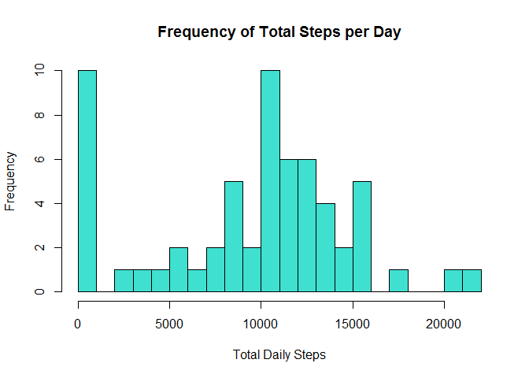
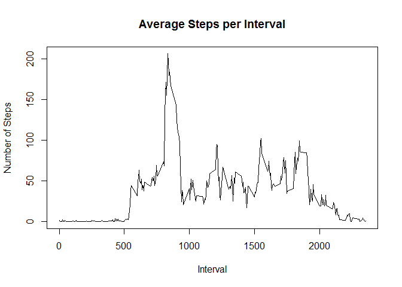
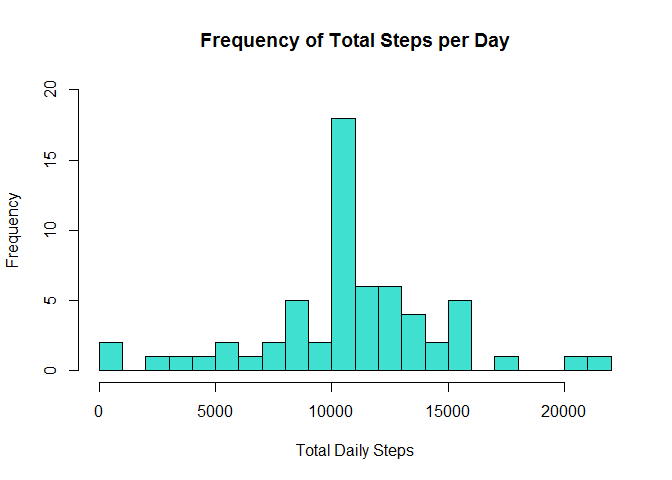
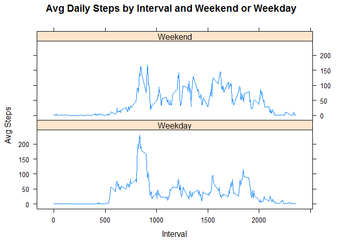

# Course Project 1: Reproducable Research

## Load and Prepare Data
Install package(s) needed

```r
library(dplyr)
library(knitr)
```

1. Load the data (i.e. read.csv())

```r
activity <- read.csv("activity.csv", header = TRUE)
```

2. Process/transform the data (if necessary) into a format suitable for your analysis

```r
activity$date <- as.Date(activity$date, '%Y-%m-%d')
```

## What is mean total number of steps taken per day?

For this part of the assignment, you can ignore the missing values in the dataset.

1. Calculate the total number of steps taken per day


```r
day_steps <- activity %>% group_by(date) %>% summarise(total=sum(steps, na.rm=T))
```

2. If you do not understand the difference between a histogram and a barplot, research the difference between them. Make a histogram of the total number of steps taken each day


```r
# X axis boundaries
min(day_steps$total)
```

```
## [1] 0
```

```r
max(day_steps$total)
```

```
## [1] 21194
```

```r
# Y axis boundaries
max(table(day_steps$total))
```

```
## [1] 8
```

```r
hist(day_steps$total, breaks=30, 
     main = "Frequency of Total Steps per Day", xlab = "Total Daily Steps", 
     xlim=c(0,22000), ylim = c(0,10), col = "turquoise")
```

<!-- -->

3. Calculate and report the mean and median of the total number of steps taken per day


```r
mean_steps <- mean(day_steps$total)
med_steps <- median(day_steps$total)
```


```r
mean_steps
```

```
## [1] 9354.23
```

```r
med_steps
```

```
## [1] 10395
```

## What is the average daily activity pattern?

1. Make a time series plot (i.e. type = "l") of the 5-minute interval (x-axis) and the average number of steps taken, averaged across all days (y-axis)


```r
interval_steps <- activity %>% group_by(interval) %>% summarise(mean_int=mean(steps, na.rm=T))

plot(interval_steps$interval, interval_steps$mean_int, type = "l", 
     main = "Average Steps per Interval", xlab="Interval", ylab="Number of Steps")
```

<!-- -->

2. Which 5-minute interval, on average across all the days in the dataset, contains the maximum number of steps?


```r
which.max(interval_steps$interval)
```

```
## [1] 288
```

## Impute missing values

Note that there are a number of days/intervals where there are missing values (coded as NA). The presence of missing days may introduce bias into some calculations or summaries of the data.

1. Calculate and report the total number of missing values in the dataset (i.e. the total number of rows with NAs)


```r
sum(is.na(activity$steps))
```

```
## [1] 2304
```

2. Devise a strategy for filling in all of the missing values in the dataset. The strategy does not need to be sophisticated. For example, you could use the mean/median for that day, or the mean for that 5-minute interval, etc.

* Use already made interval_steps dataframe as a reference for the mean

3. Create a new dataset that is equal to the original dataset but with the missing data filled in.


```r
# Merge on means as another column, set NAs to that mean
activity_new <- left_join(activity, interval_steps, by = "interval")

# If "steps" is NA, then set it to the value of the mean for that interval, else keep the same
activity_new$steps <- ifelse(is.na(activity_new$steps), activity_new$mean_int, activity_new$steps)
```

4. Make a histogram of the total number of steps taken each day and Calculate and report the mean and median total number of steps taken per day. Do these values differ from the estimates from the first part of the assignment? What is the impact of imputing missing data on the estimates of the total daily number of steps?


```r
# Calculate total steps per day with new imputed dataframe
day_steps_new <- activity_new %>% group_by(date) %>% summarise(total=sum(steps, na.rm=T))

# Min and max for axes
min(day_steps_new$total)
```

```
## [1] 41
```

```r
max(day_steps_new$total)
```

```
## [1] 21194
```

```r
# With the imputed dataset, there are more observations around the center and fewer at the left- less right skewed
hist(day_steps_new$total, breaks=30, 
     main = "Frequency of Total Steps per Day", xlab = "Total Daily Steps", 
     xlim=c(0,22000), ylim = c(0,20), col = "turquoise")
```

<!-- -->

```r
# Compare the mean and median steps for day_steps and day_steps_new
mean(day_steps$total, na.rm=T)
```

```
## [1] 9354.23
```

```r
mean(day_steps_new$total)
```

```
## [1] 10766.19
```

```r
median(day_steps$total, na.rm=T)
```

```
## [1] 10395
```

```r
median(day_steps_new$total)
```

```
## [1] 10766.19
```

```r
# The mean is larger for the imputed data frame
# The median is mainly unchanged
# The mean and the median for the new dataset are the same
```

### Are there differences in activity patterns between weekdays and weekends?

For this part the weekdays() function may be of some help here. Use the dataset with the filled-in missing values for this part.

1. Create a new factor variable in the dataset with two levels - "weekday" and "weekend" indicating whether a given date is a weekday or weekend day.


```r
# Make a day variable, then use it to distinguish between a weekday and weekend
activity_new$day <- weekdays(activity_new$date)
# Factor the variable
activity_new$weekday_weekend <- factor(ifelse(activity_new$day %in% c("Saturday", "Sunday"), "Weekend", "Weekday"))
```

2. Make a panel plot containing a time series plot (i.e. type = "l") of the 5-minute interval (x-axis) and the average number of steps taken, averaged across all weekday days or weekend days (y-axis). See the README file in the GitHub repository to see an example of what this plot should look like using simulated data.


```r
library(lattice)
```

```r
# Make new summary df with mean steps per interval by weekend or weekday
dow_int_avg <- activity_new %>% group_by(interval, weekday_weekend) %>% summarise(mean_steps=mean(steps))

# Make a panel plot w/avg by interval
xyplot(dow_int_avg$mean_steps ~ dow_int_avg$interval|dow_int_avg$weekday_weekend, type='l',
       main = "Avg Daily Steps by Interval and Weekend or Weekday", xlab = "Interval", ylab = "Avg Steps",
       layout=c(1,2))
```

<!-- -->


